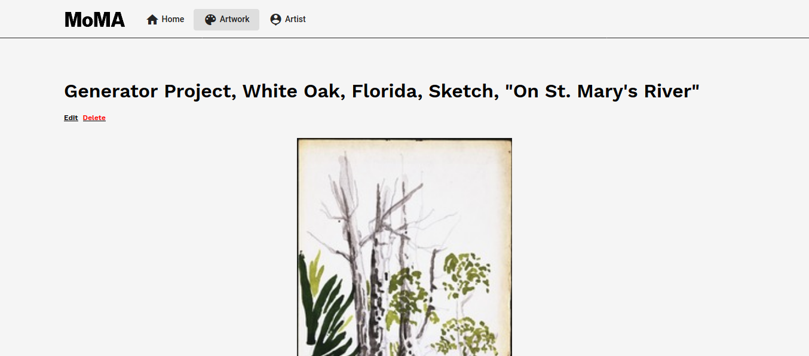
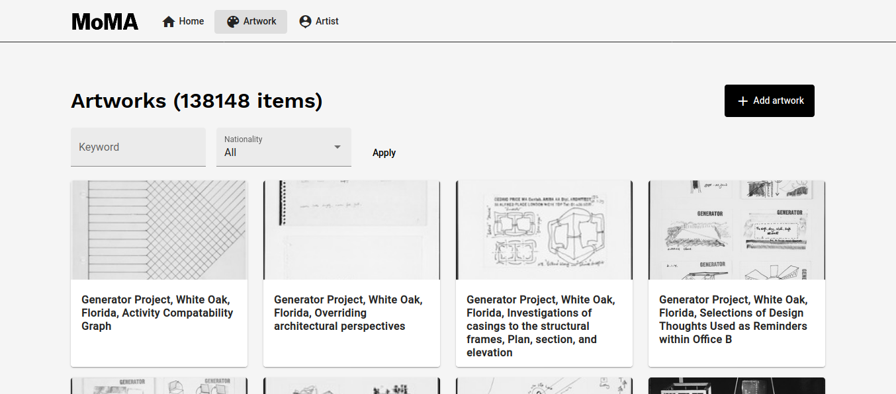
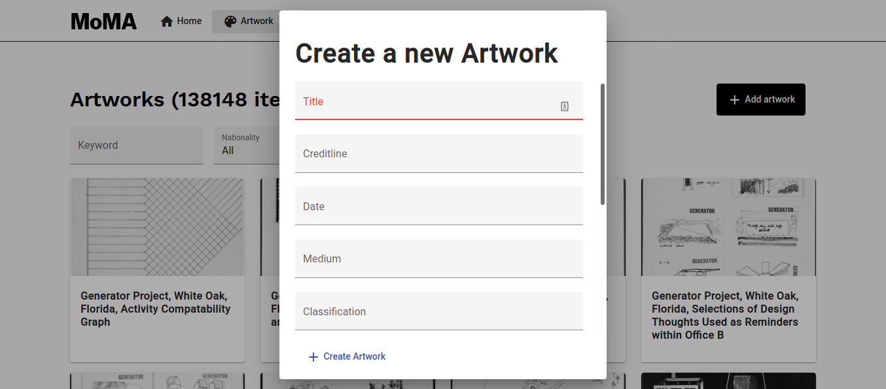

# MoMA artworks management

This repository provides an example of the development workflow using docker-compose. The dataset is taken from
[MoMa](https://github.com/MuseumofModernArt/collection)

Requirements:
 - [Docker compose](https://docs.docker.com/compose/), version >= 1.25

Elements:
 - Backend: Django + Django Rest Framework
 - Frontend: Angular 10 + Angular Material + Bootstrap (v5 - grid system only) 

Start:
    `docker-compose up -d`

The application is served in: `http://localhost:4200`

Example screens:

